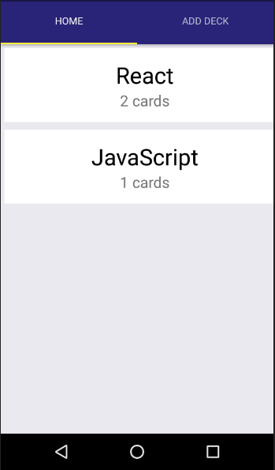
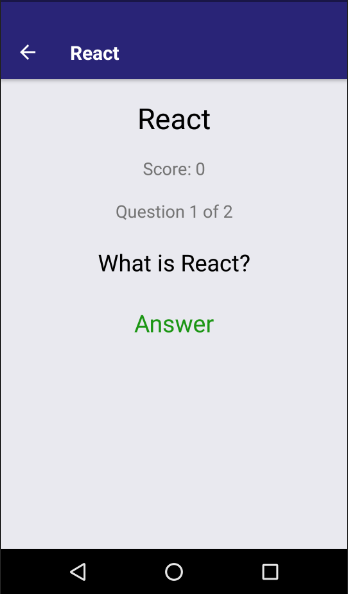

# Flashcards
Mobile App developed in React Native that allows users to study a collection of flashcards.

Platform tested: Android

### Instaling

```
clone git https://github.com/gilmarvoge/flashcards.git

-cd flashcards
-yarn install
-yarn start

```

### Requisits
- Use the create-react-native-app to build the project.
- Allow users to create a deck that may contain an unlimited number of cards.
- Allow users to add a card to a specific deck.
- The front of the card may display a question or question.
- The back of the card should display the response.
- Users must be able to test in a specific deck and receive a score when they complete the deck.
- Users should be notified to remind them to study if they did not do it on the day.

### Aditional functionality
Redux 
- A JavaScript framework for managing and maintaining application state usually used in conjunction with other frameworks to build applications.
AsyncStorage 
- AsyncStorage is React Native's API for storing data persistently over the device.  





